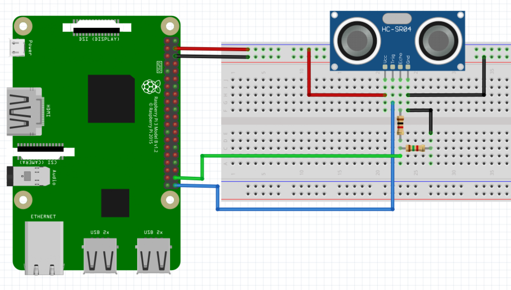

<!-- PROJECT SHIELDS -->
<!--
*** I'm using markdown "reference style" links for readability.
*** Reference links are enclosed in brackets [ ] instead of parentheses ( ).
*** See the bottom of this document for the declaration of the reference variables
*** for contributors-url, forks-url, etc. This is an optional, concise syntax you may use.
*** https://www.markdownguide.org/basic-syntax/#reference-style-links
-->
[![Contributors][contributors-shield]][contributors-url]
[![Forks][forks-shield]][forks-url]
[![Stargazers][stars-shield]][stars-url]
[![Issues][issues-shield]][issues-url]
[![MIT License][license-shield]][license-url]

<!-- PROJECT LOGO -->
 

  

<h3 align="center">Stills that move</h3>

  
[View Demo][demo-url] · [Report Bug][issues-url] · [Request a Feature][issues-url]

[Explore the docs »][docs-url]

<!-- TABLE OF CONTENTS -->

  
Table of Contents

  <ol>
    <li><a href="#about-the-project">About The Project</a></li>
    <ul>
        <li><a href="#instructables">Instructables</a></li>        
        <li><a href="#material-list">Material List</a></li>
        <li><a href="#python-packages">Python Packages</a></li>
    </ul>
    <li><a href="#electronics">Electronics</a></li>
    <ul>        
        <li><a href="#raspberry-pi">Raspberry Pi</a></li>
        <li><a href="#connecting-components">Connecting Components</a></li>
    </ul>
    <li><a href="#frame">Frame</a></li>
    <ul>        
        <li><a href="#building-overview">Building Overview</a></li>
        <li><a href="#option-greeks">...</a></li>
    </ul>
    <li><a href="#code">Code</a></li>
    <ul>        
        <li><a href="#pyton script">Python Script</a></li>
        <li><a href="#automating-on-startup">Automating on Startup</a></li>
    </ul>
    <li><a href="#usage">Usage</a></li>
    <li><a href="#contributing">Contributing</a></li>
    <li><a href="#license">License</a></li>
    <li><a href="#contact">Contact</a></li>
  </ol>

<!-- ABOUT THE PROJECT -->
## About The Project

[![Deep Nostalgia demonstration][product-screenshot]](https://github.com/BardsWork/live-portrait)

I remember watching the Live portrait scene from Harry Potter, a long time ago, and just being mesmerized by the idea. Not in the movie sense, but thinking that maybe, we can have something similar in real life. 

Once I saw the Deep Nostalgia posts circulating, I instantly knew what I wanted to build: A Harry Potter style Live Portrait.

Generally, this project is fairly simple and I will link several instructables that provide a great overview of actually building the project from scratch, including different mounting, and display, options.

The materials I used can be found below with an overview of how the building process.

 

(<a href="#top">back to top</a>)

### Instructables

Here are a few different versions I have found on instructables that hold your hand with regard to creating the entire frame. They are a great resource, even to a seasoned builder. 

- [Moving Sirius Black Wanted Poster (Harry Potter)](https://www.instructables.com/Moving-Sirius-Black-Wanted-Poster-Harry-Potter/)
  - this project has both, static and moving, components. Great resource.
- [Moving Portrait](https://www.instructables.com/Real-Life-Harry-Potter-Moving-Portraits/)
  - This project utilizes a kindle for a display, which is rather neat.
- [Live Portrait](https://www.instructables.com/Moving-Portrait-Project/)
  - This is the most similar to what I did but uses different components. Eas

 

### Material List

- [Raspberry Pi](https://www.raspberrypi.com/products/)
  - Any version of Raspberry Pi is technically usable but I would recommend at least Pi 2 as the original may be under powered. In my case, I used a Pi 2, Model B.
- [RPI Display](https://www.amazon.com/gp/product/B08H8HZRLQ/ref=ppx_yo_dt_b_search_asin_title?ie=UTF8&psc=1) 
	- Screen Dimensions: 194mm x 110mm x 20mm (including standoffs)
	- Viewable screen size: 155mm x 86mm
- [Sonar Sensor](https://www.amazon.com/SunFounder-Ultrasonic-Distance-Duemilanove-Rapsberry/dp/B00E0NXTJW/ref=sr_1_3?crid=1STSTGBNHABY2&keywords=raspberry+pi+sonar&qid=1647537058&sprefix=raspberry+pi+sonar%2Caps%2C70&sr=8-3)
	- HC-SR04 Distance Sensor to detect if someone approaches the display.
- [Small Breadboard](https://www.adafruit.com/product/65?gclid=Cj0KCQjwuMuRBhCJARIsAHXdnqNBWZgG56fXo5GaRW447T3WEkhPY-iQbos_eT4XzDZ9KkuwlbOcBSQaAgNQEALw_wcB)
	- I used the breadboard to connect HC-SR04 to the pie in a neat way. 
	- OPTIONAL
- [Picture frame mat](https://www.amazon.com/White-Picture-Backing-Board-Uncut/dp/B08B14P861/ref=sr_1_3?crid=2J03HXFC9IAD0&keywords=picture+frame+mat&qid=1647540579&sprefix=picture+frame+mat%2Caps%2C77&sr=8-3)
  - I purchased mine from Staples. I do suggest getting the uncut version so you can size it to your particular needs.
- [Speaker Fabric](https://www.amazon.com/Speaker-Stereo-Fabric-Replacement-Speakers/dp/B07V69M6VG/ref=sr_1_3?crid=1ESC7H837U6DQ&keywords=speaker+fabric&qid=1647540631&sprefix=speaker+fabric%2Caps%2C62&sr=8-3)
  - To clean up the apperance and cover the sonar, I used a speaker fabric to overlay on top of the picture frame.
- External Power Supply
- Misc wires, ties, tubes for installation
- Wood & Tools, depending on which version of the frame you decide to build. 

 

### Python Packages

The only external package that I used for this project is `omxplayer-wrapper`, which can be found [HERE](https://github.com/willprice/python-omxplayer-wrapper). Otherwise, the only `RPi.GPIO` and `time` are imported within the script files. There are fancier ways to achieve this but I chose the path of least resistance.

 

(<a href="#top">back to top</a>)

-----------------------

 

<!-- ELECTRONICS -->
## Electronics

 

_Basic connection diagram_

The basic layout of the connection can be seen in the diagram above. Depending on the model of your board, pinout may be different. Please see image below for additional context and verify via the spec sheet that came with your version of Raspberry Pi.

 

_GPIO header pinout_

 

### Raspberry Pi

 

 

### Connecting Components

 

 

(<a href="#top">back to top</a>)

-----------------------

 

<!-- FRAME -->
## Frame

 

 

### Building Overview

 

 

### Connecting Components

 

 

(<a href="#top">back to top</a>)

-----------------------

 

<!-- CODE -->
## Code

 

 

### Python Script

 

 

### Automating on Startup

 

 

(<a href="#top">back to top</a>)

-----------------------

 

<!-- CONTRIBUTING -->
## Contributing

> Please see the [open issues](https://github.com/BardsWork/live-portrait/issues) for a full list of proposed features (and known issues).

Contributions are what make the open source community such an amazing place to learn, inspire, and create. Any contributions you make are **greatly appreciated**.

If you have a suggestion that would make this better, please fork the repo and create a pull request. You can also simply open an issue with the tag "enhancement".
Don't forget to give the project a star! Thanks again!

1. Fork the Project
2. Create your Feature Branch (`git checkout -b feature/AmazingFeature`)
3. Commit your Changes (`git commit -m 'Add some AmazingFeature'`)
4. Push to the Branch (`git push origin feature/AmazingFeature`)
5. Open a Pull Request

(<a href="#top">back to top</a>)

<!-- LICENSE -->
## License

Distributed under the MIT License. See `LICENSE.txt` for more information.

(<a href="#top">back to top</a>)

<!-- CONTACT -->
## Contact

If you'd like to get in contact, the best way would probably be [twitter][@twitter-handle] or [open an issue][issues-url].

(<a href="#top">back to top</a>)

<!-- MARKDOWN LINKS & IMAGES -->
<!-- https://www.markdownguide.org/basic-syntax/#reference-style-links -->
[contributors-shield]: https://img.shields.io/github/contributors/BardsWork/live-portrait.svg?style=for-the-badge
[contributors-url]: https://github.com/BardsWork/live-portrait/graphs/contributors
[forks-shield]: https://img.shields.io/github/forks/BardsWork/live-portrait.svg?style=for-the-badge
[forks-url]: https://github.com/BardsWork/live-portrait/network/members
[stars-shield]: https://img.shields.io/github/stars/BardsWork/live-portrait.svg?style=for-the-badge
[stars-url]: https://github.com/BardsWork/live-portrait/stargazers
[issues-shield]: https://img.shields.io/github/issues/BardsWork/live-portrait.svg?style=for-the-badge
[issues-url]: https://github.com/BardsWork/live-portrait/issues
[license-shield]: https://img.shields.io/github/license/BardsWork/live-portrait.svg?style=for-the-badge
[license-url]: https://github.com/BardsWork/live-portrait/blob/main/LICENSE
[docs-url]: https://github.com/BardsWork/live-portrait
[demo-url]: https://docs.google.com/spreadsheets/d/e/2PACX-1vQD9kuzgQscJvd3i1dpvPIv7z4UCZ6HyHy3v_VGM449rp1JgG7No2_i8QV4IW87M-tIllyZCC6ng0FX/pubhtml?gid=4&single=true
[product-screenshot]: docs/images/animated-image.gif
[@twitter-handle]: https://twitter.com/bardswork
[@github-url]: https://github.com/BardsWork
