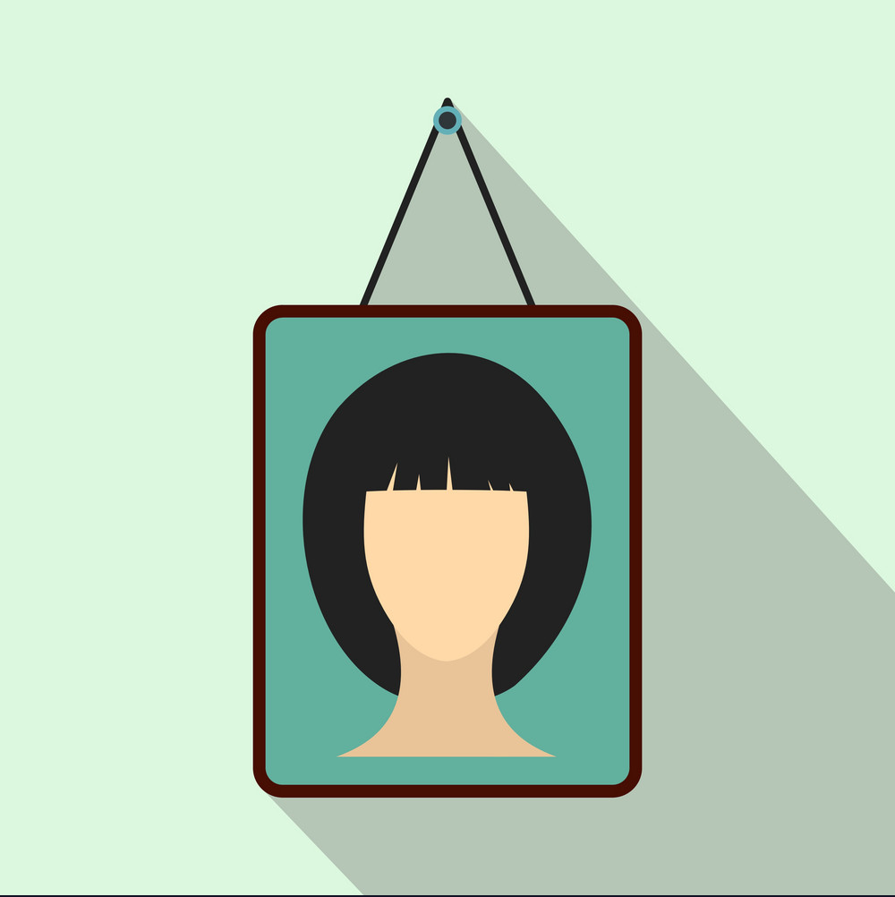

<!-- PROJECT SHIELDS -->
<!--
*** I'm using markdown "reference style" links for readability.
*** Reference links are enclosed in brackets [ ] instead of parentheses ( ).
*** See the bottom of this document for the declaration of the reference variables
*** for contributors-url, forks-url, etc. This is an optional, concise syntax you may use.
*** https://www.markdownguide.org/basic-syntax/#reference-style-links
-->
[![Contributors][contributors-shield]][contributors-url]
[![Forks][forks-shield]][forks-url]
[![Stargazers][stars-shield]][stars-url]
[![Issues][issues-shield]][issues-url]
[![MIT License][license-shield]][license-url]

<!-- PROJECT LOGO -->
 

  

<h3 align="center">A Living Portrait</h3>

  
[View Demo][demo-url] · [Report Bug][issues-url] · [Request a Feature][issues-url]

[Explore the docs »][docs-url]

<!-- TABLE OF CONTENTS -->

  
Table of Contents

  <ol>
    <li><a href="#about-the-project">About The Project</a></li>
    <li><a href="#instructables">Instructables</a></li>        
    <li><a href="#material-list">Material List</a></li>
    <li><a href="#code">Code</a></li>
    <li><a href="#usage">Usage</a></li>
    <li><a href="#contributing">Contributing</a></li>
    <li><a href="#license">License</a></li>
    <li><a href="#contact">Contact</a></li>
  </ol>

<!-- ABOUT THE PROJECT -->
## About The Project

[![Deep Nostalgia demonstration][product-screenshot]](https://github.com/BardsWork/live-portrait)

This project aims to display a static image using a raspberry pi onto a display and animate it via [MyHeritage Deep Nostalgia](https://www.myheritage.com/deep-nostalgia) and a sonar/proximity sensor. The project is broken down into two parts:

1. Building a raspberry powered picture frame.
2. Tracking data from the sonar to play a video within a desired range and duration using a Python script.

To not re-invent the wheel, I've included some Instructables tutorials that I've found which showcase the building of the picture frame. As there are several display options, I've chosen a wide gamut of display options. Personally, I've chosen a simple RPI display and just made a custom frame to suit my needs. I've included my own material list and included non-affiliated links.

 

(<a href="#top">back to top</a>)

### Instructables

Here are a few different versions I have found on instructables that hold your hand with regard to creating the entire frame. They are a great resource, even to a seasoned builder. 

- [Moving Sirius Black Wanted Poster (Harry Potter)](https://www.instructables.com/Moving-Sirius-Black-Wanted-Poster-Harry-Potter/)
  - this project has both, static and moving, components. Great resource.
- [Moving Portrait](https://www.instructables.com/Real-Life-Harry-Potter-Moving-Portraits/)
  - This project utilizes a kindle for a display, which is rather neat.
- [Live Portrait](https://www.instructables.com/Moving-Portrait-Project/)
  - This is the most similar to what I did but uses different components. Eas

 

### Material List

- [Raspberry Pi](https://www.raspberrypi.com/products/)
  - Any version of Raspberry Pi is technically usable but I would recommend at least Pi 2 as the original may be under powered. In my case, I used a Pi 2, Model B.
- [RPI Display](https://www.amazon.com/gp/product/B08H8HZRLQ/ref=ppx_yo_dt_b_search_asin_title?ie=UTF8&psc=1) 
	- Screen Dimensions: 194mm x 110mm x 20mm (including standoffs)
	- Viewable screen size: 155mm x 86mm
- [Sonar Sensor](https://www.amazon.com/SunFounder-Ultrasonic-Distance-Duemilanove-Rapsberry/dp/B00E0NXTJW/ref=sr_1_3?crid=1STSTGBNHABY2&keywords=raspberry+pi+sonar&qid=1647537058&sprefix=raspberry+pi+sonar%2Caps%2C70&sr=8-3)
	- HC-SR04 Distance Sensor to detect if someone approaches the display.
- [Small Breadboard (Optional)](https://www.adafruit.com/product/65?gclid=Cj0KCQjwuMuRBhCJARIsAHXdnqNBWZgG56fXo5GaRW447T3WEkhPY-iQbos_eT4XzDZ9KkuwlbOcBSQaAgNQEALw_wcB)
	- I used the breadboard to connect HC-SR04 to the pie in a neat way. 
	- OPTIONAL
- [Picture frame mat (Optional)](https://www.amazon.com/White-Picture-Backing-Board-Uncut/dp/B08B14P861/ref=sr_1_3?crid=2J03HXFC9IAD0&keywords=picture+frame+mat&qid=1647540579&sprefix=picture+frame+mat%2Caps%2C77&sr=8-3)
  - I purchased mine from Staples. I do suggest getting the uncut version so you can size it to your particular needs.
- [Speaker Fabric (Optional)](https://www.amazon.com/Speaker-Stereo-Fabric-Replacement-Speakers/dp/B07V69M6VG/ref=sr_1_3?crid=1ESC7H837U6DQ&keywords=speaker+fabric&qid=1647540631&sprefix=speaker+fabric%2Caps%2C62&sr=8-3)
  - To clean up the appearance and cover the sonar, I used a speaker fabric to overlay on top of the picture frame.
- External Power Supply
- Misc wires, ties, tubes for installation
- Wood & Tools, depending on which version of the frame you decide to build. 

 

### Code

`omxplayer-wrapper`, which can be found [HERE](https://github.com/willprice/python-omxplayer-wrapper) is a wrapper for the native RPI video player. It was one of the simplest solutions to use but is a bit finicky, at times. 

There are several variables that you have to adjust: 

 

#### `main.py`

`VIDEO_PATH` - the path of the video on the RPI. The first frame will be displayed as the static image.

`DISTANCE` - the distance at which the auto-play will trigger, in centimeters.

 

#### `player.py`

`_SLEEP` - a delay to allow the video to be loaded into the buffer on initialization. This may be obsolete in newer versions of RPI.

 

#### `sensor.py`

`_PIN_TRIGGER` - corresponds to the pin that monitors the sonar sensor. When a signal is detected within the provided distance, the video will play.

`_PIN_ECHO` - corresponds to the pin that sends the signal to the sonar to actively monitor the surroundings.

 

(<a href="#top">back to top</a>)

-----------------------

 

<!-- CONTRIBUTING -->
## Contributing

> Please see the [open issues](https://github.com/BardsWork/live-portrait/issues) for a full list of proposed features (and known issues).

Contributions are what make the open source community such an amazing place to learn, inspire, and create. Any contributions you make are **greatly appreciated**.

If you have a suggestion that would make this better, please fork the repo and create a pull request. You can also simply open an issue with the tag "enhancement".
Don't forget to give the project a star! Thanks again!

1. Fork the Project
2. Create your Feature Branch (`git checkout -b feature/AmazingFeature`)
3. Commit your Changes (`git commit -m 'Add some AmazingFeature'`)
4. Push to the Branch (`git push origin feature/AmazingFeature`)
5. Open a Pull Request

(<a href="#top">back to top</a>)

<!-- LICENSE -->
## License

Distributed under the MIT License. See `LICENSE.txt` for more information.

(<a href="#top">back to top</a>)

<!-- CONTACT -->
## Contact

If you'd like to get in contact, the best way would probably be [twitter][@twitter-handle] or [open an issue][issues-url].

(<a href="#top">back to top</a>)

<!-- MARKDOWN LINKS & IMAGES -->
<!-- https://www.markdownguide.org/basic-syntax/#reference-style-links -->
[contributors-shield]: https://img.shields.io/github/contributors/BardsWork/live-portrait.svg?style=for-the-badge
[contributors-url]: https://github.com/BardsWork/live-portrait/graphs/contributors
[forks-shield]: https://img.shields.io/github/forks/BardsWork/live-portrait.svg?style=for-the-badge
[forks-url]: https://github.com/BardsWork/live-portrait/network/members
[stars-shield]: https://img.shields.io/github/stars/BardsWork/live-portrait.svg?style=for-the-badge
[stars-url]: https://github.com/BardsWork/live-portrait/stargazers
[issues-shield]: https://img.shields.io/github/issues/BardsWork/live-portrait.svg?style=for-the-badge
[issues-url]: https://github.com/BardsWork/live-portrait/issues
[license-shield]: https://img.shields.io/github/license/BardsWork/live-portrait.svg?style=for-the-badge
[license-url]: https://github.com/BardsWork/live-portrait/blob/main/LICENSE
[docs-url]: https://github.com/BardsWork/live-portrait
[demo-url]: https://docs.google.com/spreadsheets/d/e/2PACX-1vQD9kuzgQscJvd3i1dpvPIv7z4UCZ6HyHy3v_VGM449rp1JgG7No2_i8QV4IW87M-tIllyZCC6ng0FX/pubhtml?gid=4&single=true
[product-screenshot]: docs/images/animated-image.gif
[@twitter-handle]: https://twitter.com/bardswork
[@github-url]: https://github.com/BardsWork
